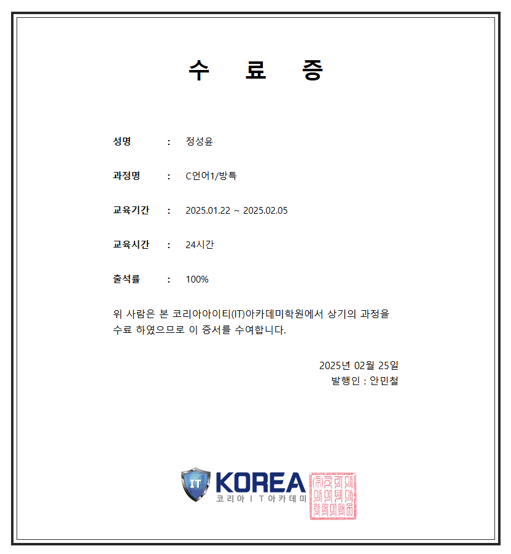

# JAVA
JAVA Bacis Study

INDEX
---
|-|-|
|-|-|
|Ch1. 개요|[바로가기](./00.%20공부정리/Ch1.%20개요)|
|Ch2. 진수와 보수|[바로가기](00.%20공부정리/Ch2.%20진수와%20보수)|
|Ch3. 자료형과 변수형|[바로가기](./00.%20공부정리/Ch3.%20자료형과%20변수형)|
|Ch4. 자료형 변환|[바로가기](./00.%20공부정리/Ch4.%20자료형%20변환)|
|Ch5. 입력문|[바로가기](./00.%20공부정리/Ch5.%20입력문)|
|Ch6. 연산자|[바로가기](./00.%20공부정리/Ch6.%20연산자)|-|
|Ch7. 분기문(if문)|[바로가기](./00.%20공부정리/Ch7.%20분기문(if문))|
|Ch8. 분기문(switch문)|[바로가기](./00.%20공부정리/Ch8.%20분기문(switch문))|
|Ch9. 분기문-반복문(While문)|[바로가기](./00.%20공부정리/Ch9.%20분기문-반복문(While문))|
|Ch10. 제어문|[바로가기](./00.%20공부정리/Ch10.%20제어문)|
|Ch11. 분기문(for문)|[바로가기](./00.%20공부정리/Ch11.%20분기문(for문))|
|Ch12. 클래스 (자료형) & 객체|[바로가기](./00.%20공부정리/Ch12.%20클래스%20(자료형)%20&%20객체)|
|Ch13. 메서드|[바로가기](./00.%20공부정리/Ch13.메서드)|
|Ch14. 생성자 매세드 & 인수 & 매게변수|[바로가기](./00.%20공부정리/Ch14%20.생성자%20매세드%20&%20인수%20&%20매게변수)|
|Ch15. 지역변수와 전역변수|[바로가기](./00.%20공부정리/Ch15.%20지역변수와%20전역변수)|
|Ch16. 메서드 오버로딩|[바로가기](./00.%20공부정리/Ch16.%20메서드%20오버로딩)|
|Ch17. This & 문자열 클래스|[바로가기](./00.%20공부정리/Ch17.%20This%20&%20문자열%20클래스)|
|Ch18. 상속|[바로가기](./00.%20공부정리/Ch18.%20상속)|
|Ch19. 자바의 메모리 구조|[바로가기](./00.%20공부정리/Ch19.%20자바의%20메모리%20구조)|
|Ch20. 배열|[바로가기](./00.%20공부정리/Ch20.%20배열)|
|Ch21. 추상 클래스& 추상 메서드|[바로가기](./00.%20공부정리/Ch21.%20추상%20클래스&%20추상%20메서드)|
|Ch22. 인터페이스|[바로가기](./00.%20공부정리/Ch22.%20인터페이스)|
|Ch23. API Class|[바로가기](./00.%20공부정리/Ch23.%20API%20Class)|
|Ch24. 예외처리|[바로가기](./00.%20공부정리/Ch24.%20예외처리)|
|Ch25. JDBC|[바로가기](./00.%20공부정리/Ch25.%20JDBC)|
|Ch26. Outputstream & Inputstream|[바로가기](./00.%20공부정리/Ch26.%20Outputstream%20&%20Inputstream)|
|Ch27. Writer & Reader|[바로가기](./00.%20공부정리/Ch27.%20Writer%20&%20Reader)|

